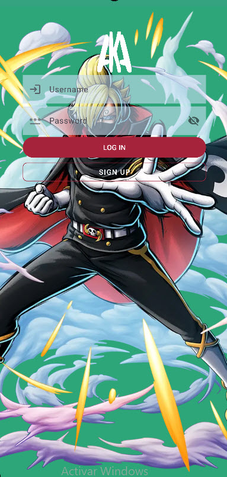
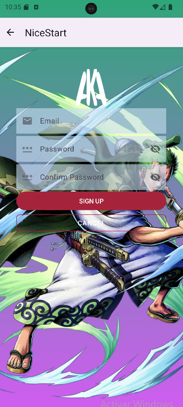
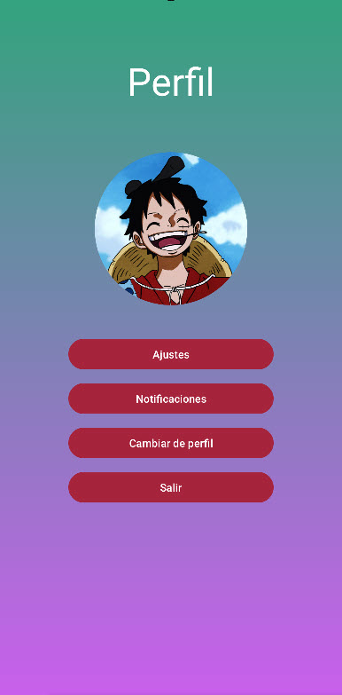
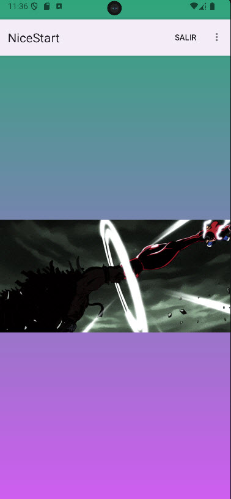

# Aplicación de Desarrollo de Interfaces

Esta aplicación ha sido desarrollada como parte de un proyecto de creación de interfaces. A continuación, se presentan las características y los cambios implementados.

## Cambios Realizados

- **Actualización de animación**: Se ha mejorado la animación en la pantalla de carga.
- **Nuevas pantallas de carga**: Se han añadido imágenes para diversas pantallas de carga.
- **Nuevo logo**: La aplicación ahora cuenta con un logo actualizado.

## Características de la Aplicación

La aplicación cuenta con las siguientes pantallas:

### Pantalla de Splash

- Introducción visual mientras se cargan los recursos.
- Animación de parpadeo en el logo de la aplicación, centrado para una experiencia atractiva.
- La transición a la pantalla de **Login** es automática y fluida, ocurriendo después de 5 segundos.

  

### Pantalla de Login

- Interfaz amigable que permite a los usuarios iniciar sesión.
- **Glide** integrado para gestión y carga de imágenes.

  

### Pantalla de Registro

- Interfaz sencilla para el registro de nuevos usuarios.
- También incluye **Glide** para la carga de imágenes.

  

### Pantalla de Perfil

- Nueva pantalla que permitirá a los usuarios visualizar y editar su información personal (en desarrollo y aún no accesible).

  

### Pantalla Principal

- En desarrollo y planeada para futuras actualizaciones.

  
